# Description

See the [test config file]({cfg}).

 * [Test-1: PragueDCTCPfbackimmediate vs ['PragueDCTCPfbackreqgrant', 'CubicDCTCPfbackimmediate'] at 20Mbit/20ms](#test-1-praguedctcpfbackimmediate-vs-['praguedctcpfbackreqgrant',-'cubicdctcpfbackimmediate']-at-20mbit/20ms)
 * [Test-2: PragueAccECN-minoptackimmediate vs ['PragueAccECN-minoptackreqgrant', 'CubicDCTCPfbackimmediate'] at 20Mbit/20ms](#test-2-pragueaccecn-minoptackimmediate-vs-['pragueaccecn-minoptackreqgrant',-'cubicdctcpfbackimmediate']-at-20mbit/20ms)
 * [Test-3: PragueAccECN-alwaysoptackimmediate vs ['PragueAccECN-alwaysoptackreqgrant', 'CubicDCTCPfbackimmediate'] at 20Mbit/20ms](#test-3-pragueaccecn-alwaysoptackimmediate-vs-['pragueaccecn-alwaysoptackreqgrant',-'cubicdctcpfbackimmediate']-at-20mbit/20ms)
 * [Test-4: PragueAccECN-nooptackimmediate vs ['PragueAccECN-nooptackreqgrant', 'CubicDCTCPfbackimmediate'] at 20Mbit/20ms](#test-4-pragueaccecn-nooptackimmediate-vs-['pragueaccecn-nooptackreqgrant',-'cubicdctcpfbackimmediate']-at-20mbit/20ms)
 * [Test-5: PragueDCTCPfbackimmediate vs ['PragueDCTCPfbackreqgrant', 'CubicDCTCPfbackimmediate'] at 20Mbit/40ms](#test-5-praguedctcpfbackimmediate-vs-['praguedctcpfbackreqgrant',-'cubicdctcpfbackimmediate']-at-20mbit/40ms)
 * [Test-6: PragueAccECN-minoptackimmediate vs ['PragueAccECN-minoptackreqgrant', 'CubicDCTCPfbackimmediate'] at 20Mbit/40ms](#test-6-pragueaccecn-minoptackimmediate-vs-['pragueaccecn-minoptackreqgrant',-'cubicdctcpfbackimmediate']-at-20mbit/40ms)
 * [Test-7: PragueAccECN-alwaysoptackimmediate vs ['PragueAccECN-alwaysoptackreqgrant', 'CubicDCTCPfbackimmediate'] at 20Mbit/40ms](#test-7-pragueaccecn-alwaysoptackimmediate-vs-['pragueaccecn-alwaysoptackreqgrant',-'cubicdctcpfbackimmediate']-at-20mbit/40ms)
 * [Test-8: PragueAccECN-nooptackimmediate vs ['PragueAccECN-nooptackreqgrant', 'CubicDCTCPfbackimmediate'] at 20Mbit/40ms](#test-8-pragueaccecn-nooptackimmediate-vs-['pragueaccecn-nooptackreqgrant',-'cubicdctcpfbackimmediate']-at-20mbit/40ms)
 * [Test-9: PragueDCTCPfbackimmediate vs ['PragueDCTCPfbackreqgrant', 'CubicDCTCPfbackimmediate'] at 20Mbit/80ms](#test-9-praguedctcpfbackimmediate-vs-['praguedctcpfbackreqgrant',-'cubicdctcpfbackimmediate']-at-20mbit/80ms)
 * [Test-10: PragueAccECN-minoptackimmediate vs ['PragueAccECN-minoptackreqgrant', 'CubicDCTCPfbackimmediate'] at 20Mbit/80ms](#test-10-pragueaccecn-minoptackimmediate-vs-['pragueaccecn-minoptackreqgrant',-'cubicdctcpfbackimmediate']-at-20mbit/80ms)
 * [Test-11: PragueAccECN-alwaysoptackimmediate vs ['PragueAccECN-alwaysoptackreqgrant', 'CubicDCTCPfbackimmediate'] at 20Mbit/80ms](#test-11-pragueaccecn-alwaysoptackimmediate-vs-['pragueaccecn-alwaysoptackreqgrant',-'cubicdctcpfbackimmediate']-at-20mbit/80ms)
 * [Test-12: PragueAccECN-nooptackimmediate vs ['PragueAccECN-nooptackreqgrant', 'CubicDCTCPfbackimmediate'] at 20Mbit/80ms](#test-12-pragueaccecn-nooptackimmediate-vs-['pragueaccecn-nooptackreqgrant',-'cubicdctcpfbackimmediate']-at-20mbit/80ms)
 * [Test-13: PragueDCTCPfbackimmediate vs ['PragueDCTCPfbackreqgrant', 'CubicDCTCPfbackimmediate'] at 100Mbit/20ms](#test-13-praguedctcpfbackimmediate-vs-['praguedctcpfbackreqgrant',-'cubicdctcpfbackimmediate']-at-100mbit/20ms)
 * [Test-14: PragueAccECN-minoptackimmediate vs ['PragueAccECN-minoptackreqgrant', 'CubicDCTCPfbackimmediate'] at 100Mbit/20ms](#test-14-pragueaccecn-minoptackimmediate-vs-['pragueaccecn-minoptackreqgrant',-'cubicdctcpfbackimmediate']-at-100mbit/20ms)
 * [Test-15: PragueAccECN-alwaysoptackimmediate vs ['PragueAccECN-alwaysoptackreqgrant', 'CubicDCTCPfbackimmediate'] at 100Mbit/20ms](#test-15-pragueaccecn-alwaysoptackimmediate-vs-['pragueaccecn-alwaysoptackreqgrant',-'cubicdctcpfbackimmediate']-at-100mbit/20ms)
 * [Test-16: PragueAccECN-nooptackimmediate vs ['PragueAccECN-nooptackreqgrant', 'CubicDCTCPfbackimmediate'] at 100Mbit/20ms](#test-16-pragueaccecn-nooptackimmediate-vs-['pragueaccecn-nooptackreqgrant',-'cubicdctcpfbackimmediate']-at-100mbit/20ms)
 * [Test-17: PragueDCTCPfbackimmediate vs ['PragueDCTCPfbackreqgrant', 'CubicDCTCPfbackimmediate'] at 100Mbit/40ms](#test-17-praguedctcpfbackimmediate-vs-['praguedctcpfbackreqgrant',-'cubicdctcpfbackimmediate']-at-100mbit/40ms)
 * [Test-18: PragueAccECN-minoptackimmediate vs ['PragueAccECN-minoptackreqgrant', 'CubicDCTCPfbackimmediate'] at 100Mbit/40ms](#test-18-pragueaccecn-minoptackimmediate-vs-['pragueaccecn-minoptackreqgrant',-'cubicdctcpfbackimmediate']-at-100mbit/40ms)
 * [Test-19: PragueAccECN-alwaysoptackimmediate vs ['PragueAccECN-alwaysoptackreqgrant', 'CubicDCTCPfbackimmediate'] at 100Mbit/40ms](#test-19-pragueaccecn-alwaysoptackimmediate-vs-['pragueaccecn-alwaysoptackreqgrant',-'cubicdctcpfbackimmediate']-at-100mbit/40ms)
 * [Test-20: PragueAccECN-nooptackimmediate vs ['PragueAccECN-nooptackreqgrant', 'CubicDCTCPfbackimmediate'] at 100Mbit/40ms](#test-20-pragueaccecn-nooptackimmediate-vs-['pragueaccecn-nooptackreqgrant',-'cubicdctcpfbackimmediate']-at-100mbit/40ms)
 * [Test-21: PragueDCTCPfbackimmediate vs ['PragueDCTCPfbackreqgrant', 'CubicDCTCPfbackimmediate'] at 100Mbit/80ms](#test-21-praguedctcpfbackimmediate-vs-['praguedctcpfbackreqgrant',-'cubicdctcpfbackimmediate']-at-100mbit/80ms)
 * [Test-22: PragueAccECN-minoptackimmediate vs ['PragueAccECN-minoptackreqgrant', 'CubicDCTCPfbackimmediate'] at 100Mbit/80ms](#test-22-pragueaccecn-minoptackimmediate-vs-['pragueaccecn-minoptackreqgrant',-'cubicdctcpfbackimmediate']-at-100mbit/80ms)
 * [Test-23: PragueAccECN-alwaysoptackimmediate vs ['PragueAccECN-alwaysoptackreqgrant', 'CubicDCTCPfbackimmediate'] at 100Mbit/80ms](#test-23-pragueaccecn-alwaysoptackimmediate-vs-['pragueaccecn-alwaysoptackreqgrant',-'cubicdctcpfbackimmediate']-at-100mbit/80ms)
 * [Test-24: PragueAccECN-nooptackimmediate vs ['PragueAccECN-nooptackreqgrant', 'CubicDCTCPfbackimmediate'] at 100Mbit/80ms](#test-24-pragueaccecn-nooptackimmediate-vs-['pragueaccecn-nooptackreqgrant',-'cubicdctcpfbackimmediate']-at-100mbit/80ms)

# Test-1: PragueDCTCPfbackimmediate vs ['PragueDCTCPfbackreqgrant', 'CubicDCTCPfbackimmediate'] at 20Mbit/20ms

RTT: 20ms

BW: 20Mbit

AQM: dualpi2

CCA for flow (1): prague
CCA for flow (2): pragueCCA for flow (3): cubic
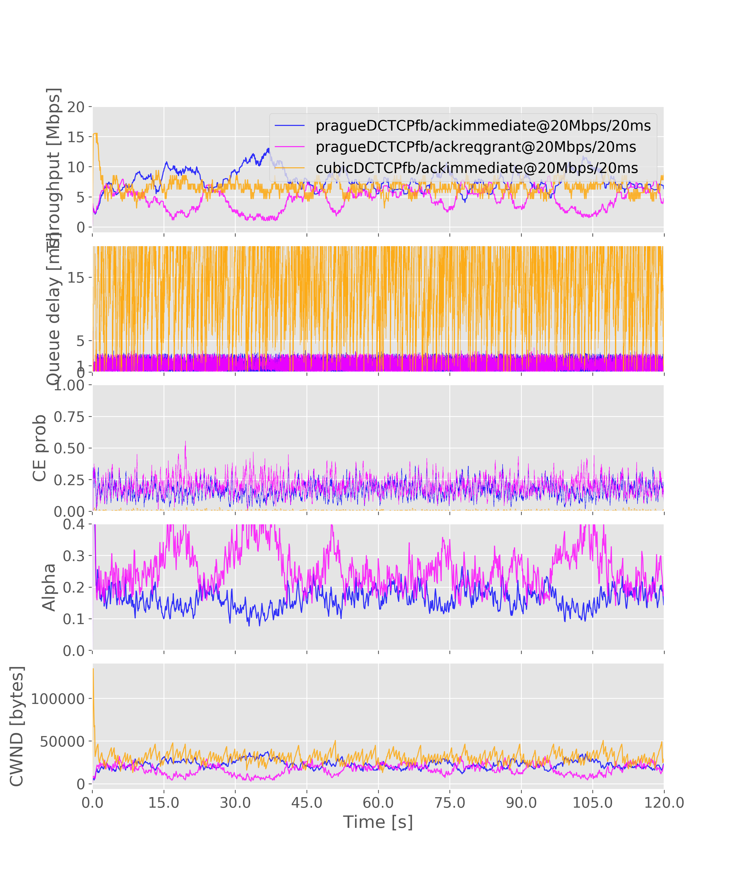

[Go back to index](#description)

# Test-2: PragueAccECN-minoptackimmediate vs ['PragueAccECN-minoptackreqgrant', 'CubicDCTCPfbackimmediate'] at 20Mbit/20ms

RTT: 20ms

BW: 20Mbit

AQM: dualpi2

CCA for flow (1): prague
CCA for flow (2): pragueCCA for flow (3): cubic
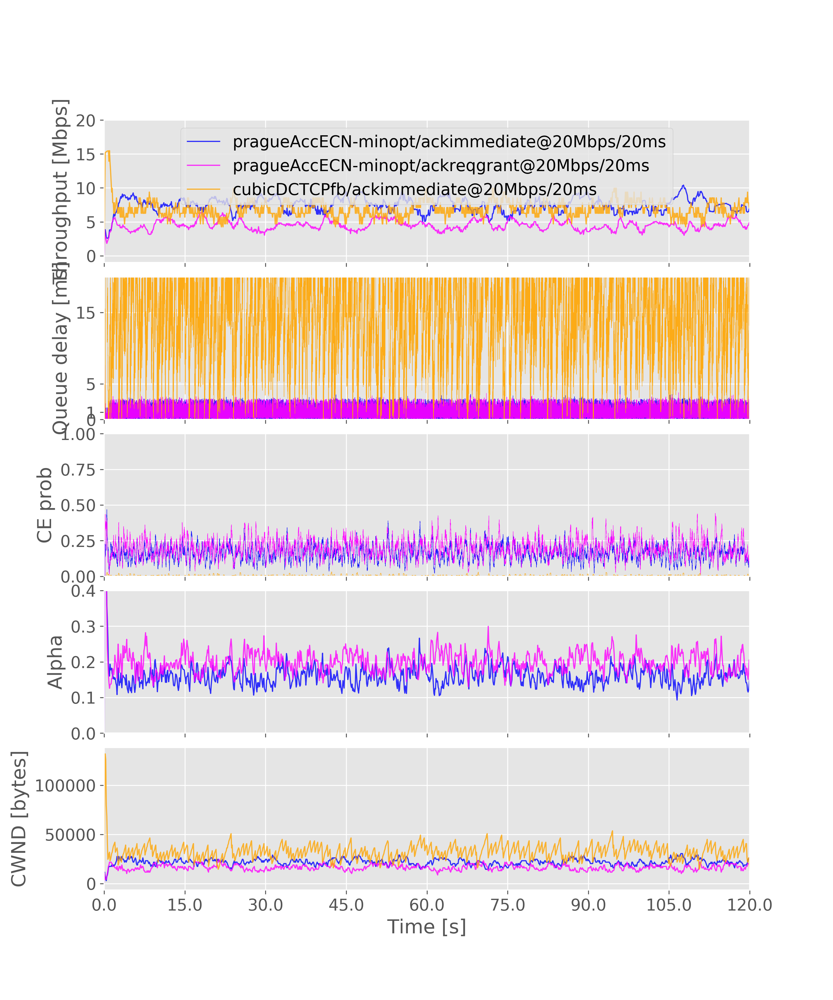

[Go back to index](#description)

# Test-3: PragueAccECN-alwaysoptackimmediate vs ['PragueAccECN-alwaysoptackreqgrant', 'CubicDCTCPfbackimmediate'] at 20Mbit/20ms

RTT: 20ms

BW: 20Mbit

AQM: dualpi2

CCA for flow (1): prague
CCA for flow (2): pragueCCA for flow (3): cubic
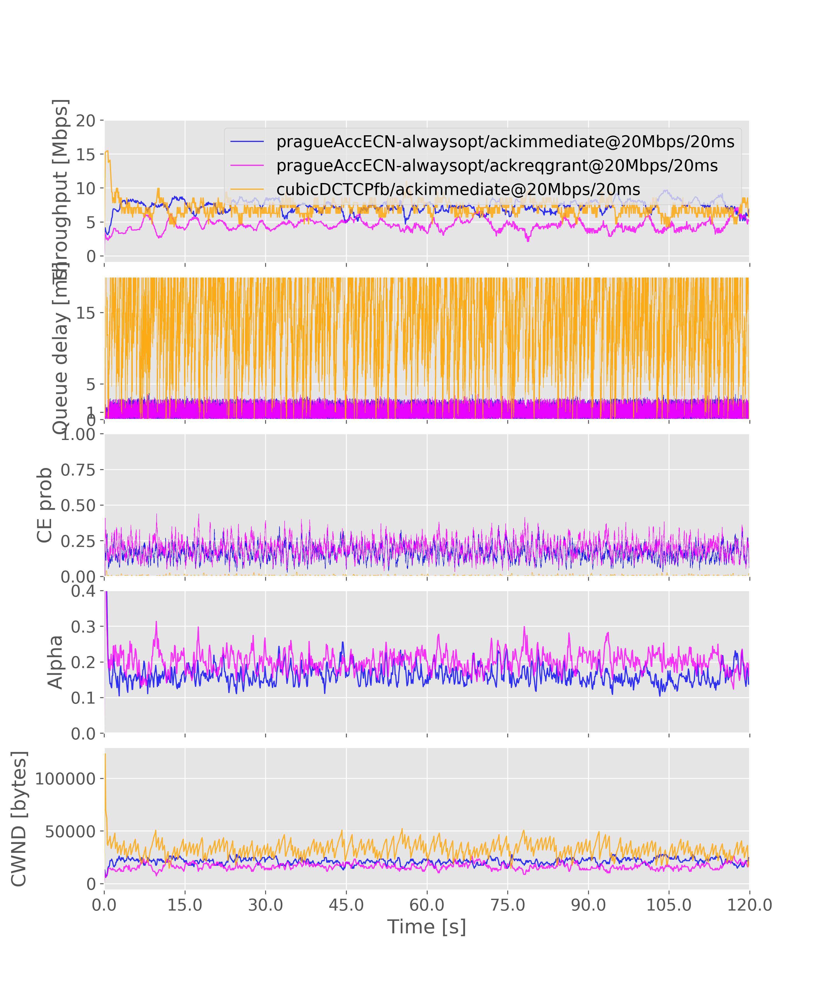

[Go back to index](#description)

# Test-4: PragueAccECN-nooptackimmediate vs ['PragueAccECN-nooptackreqgrant', 'CubicDCTCPfbackimmediate'] at 20Mbit/20ms

RTT: 20ms

BW: 20Mbit

AQM: dualpi2

CCA for flow (1): prague
CCA for flow (2): pragueCCA for flow (3): cubic
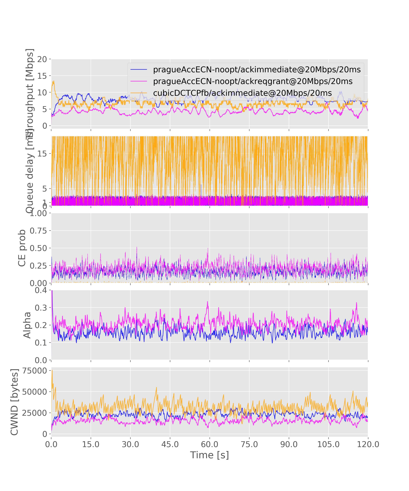

[Go back to index](#description)

# Test-5: PragueDCTCPfbackimmediate vs ['PragueDCTCPfbackreqgrant', 'CubicDCTCPfbackimmediate'] at 20Mbit/40ms

RTT: 40ms

BW: 20Mbit

AQM: dualpi2

CCA for flow (1): prague
CCA for flow (2): pragueCCA for flow (3): cubic

[Go back to index](#description)

# Test-6: PragueAccECN-minoptackimmediate vs ['PragueAccECN-minoptackreqgrant', 'CubicDCTCPfbackimmediate'] at 20Mbit/40ms

RTT: 40ms

BW: 20Mbit

AQM: dualpi2

CCA for flow (1): prague
CCA for flow (2): pragueCCA for flow (3): cubic
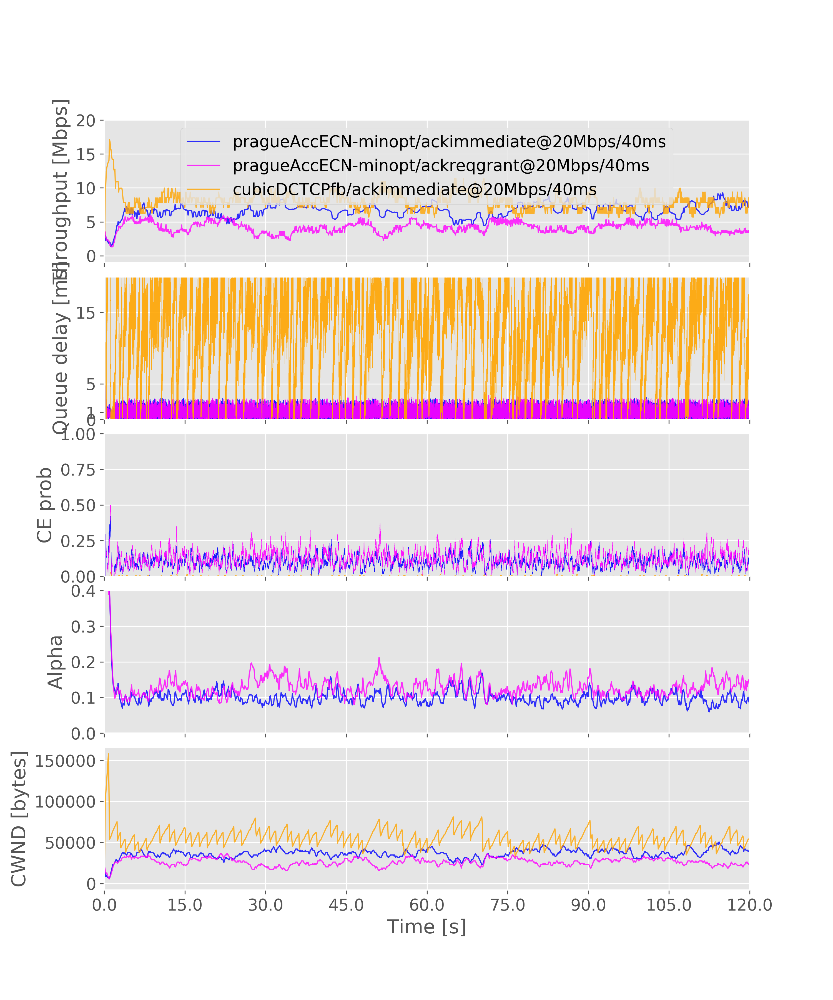

[Go back to index](#description)

# Test-7: PragueAccECN-alwaysoptackimmediate vs ['PragueAccECN-alwaysoptackreqgrant', 'CubicDCTCPfbackimmediate'] at 20Mbit/40ms

RTT: 40ms

BW: 20Mbit

AQM: dualpi2

CCA for flow (1): prague
CCA for flow (2): pragueCCA for flow (3): cubic
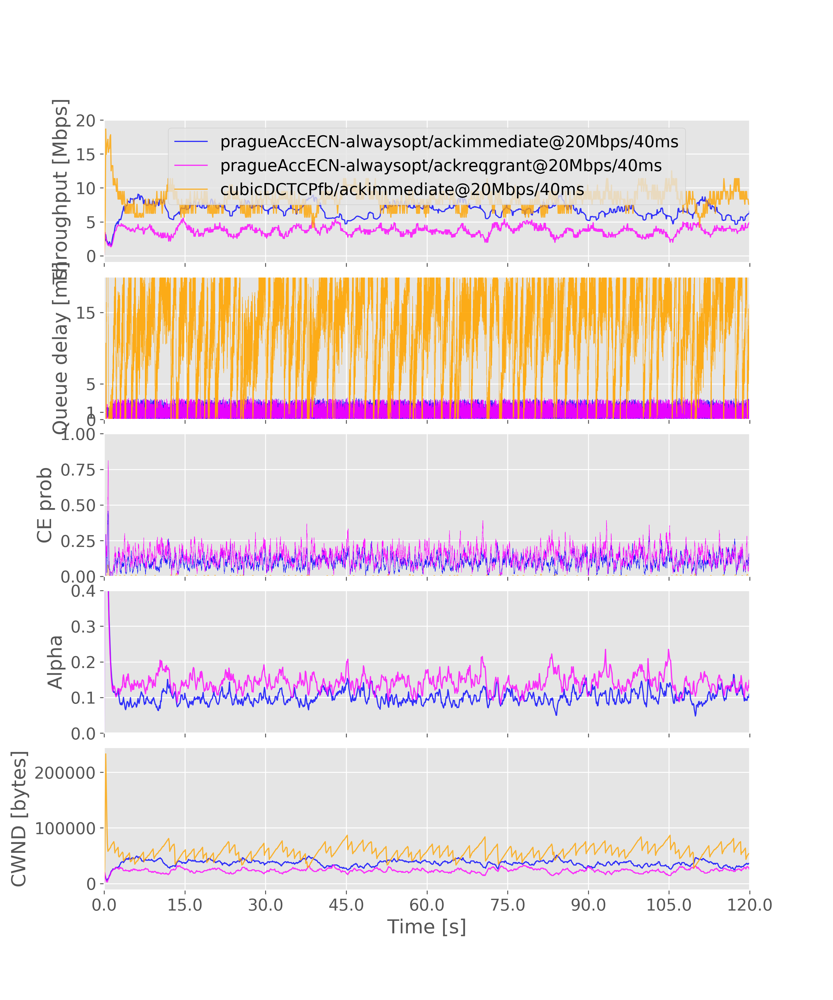

[Go back to index](#description)

# Test-8: PragueAccECN-nooptackimmediate vs ['PragueAccECN-nooptackreqgrant', 'CubicDCTCPfbackimmediate'] at 20Mbit/40ms

RTT: 40ms

BW: 20Mbit

AQM: dualpi2

CCA for flow (1): prague
CCA for flow (2): pragueCCA for flow (3): cubic
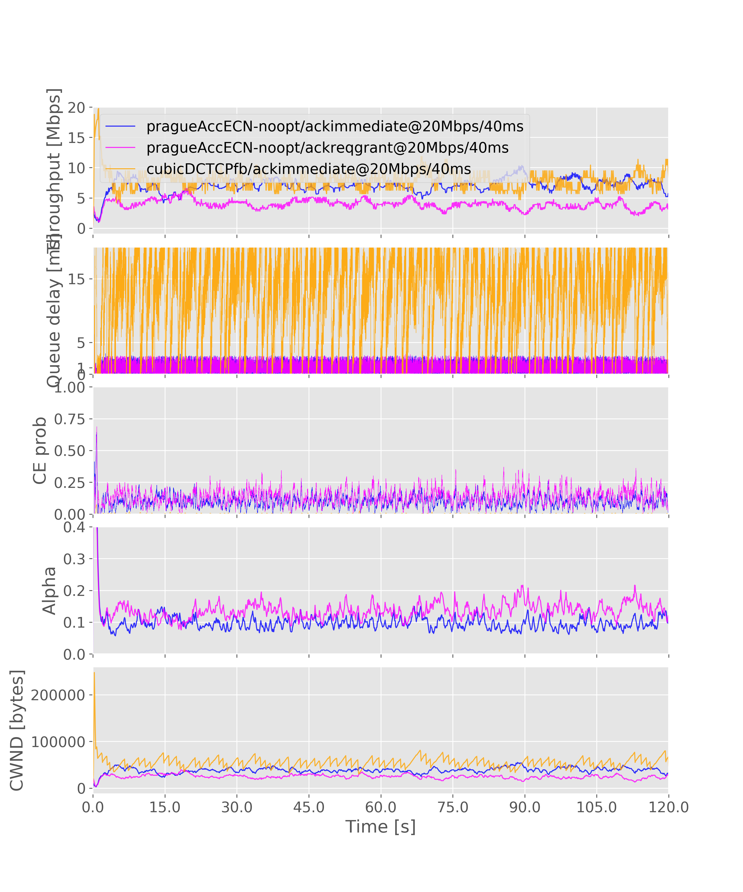

[Go back to index](#description)

# Test-9: PragueDCTCPfbackimmediate vs ['PragueDCTCPfbackreqgrant', 'CubicDCTCPfbackimmediate'] at 20Mbit/80ms

RTT: 80ms

BW: 20Mbit

AQM: dualpi2

CCA for flow (1): prague
CCA for flow (2): pragueCCA for flow (3): cubic
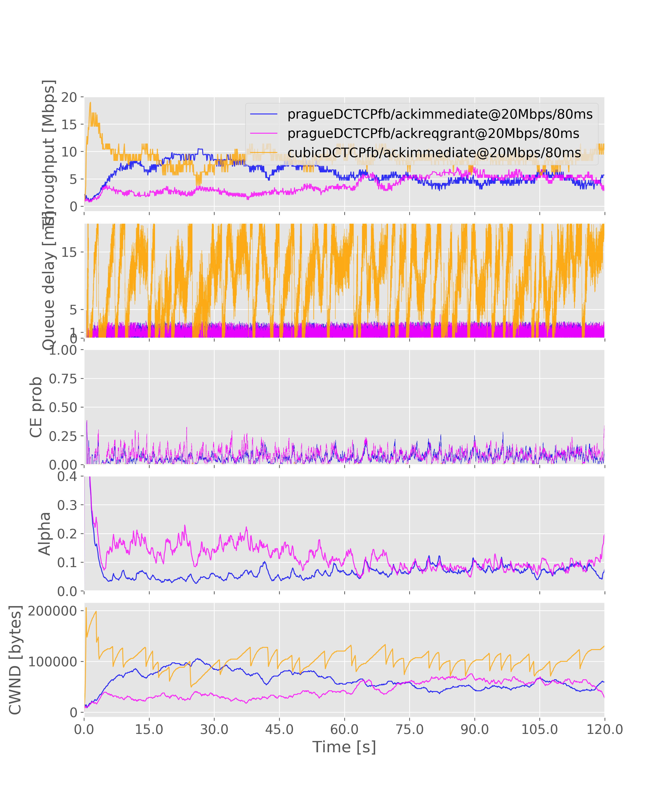

[Go back to index](#description)

# Test-10: PragueAccECN-minoptackimmediate vs ['PragueAccECN-minoptackreqgrant', 'CubicDCTCPfbackimmediate'] at 20Mbit/80ms

RTT: 80ms

BW: 20Mbit

AQM: dualpi2

CCA for flow (1): prague
CCA for flow (2): pragueCCA for flow (3): cubic
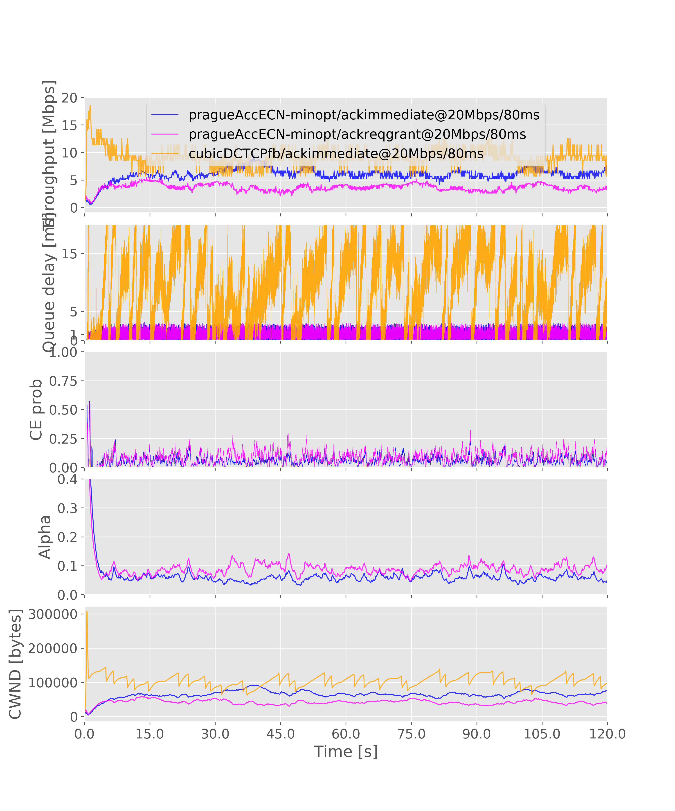

[Go back to index](#description)

# Test-11: PragueAccECN-alwaysoptackimmediate vs ['PragueAccECN-alwaysoptackreqgrant', 'CubicDCTCPfbackimmediate'] at 20Mbit/80ms

RTT: 80ms

BW: 20Mbit

AQM: dualpi2

CCA for flow (1): prague
CCA for flow (2): pragueCCA for flow (3): cubic
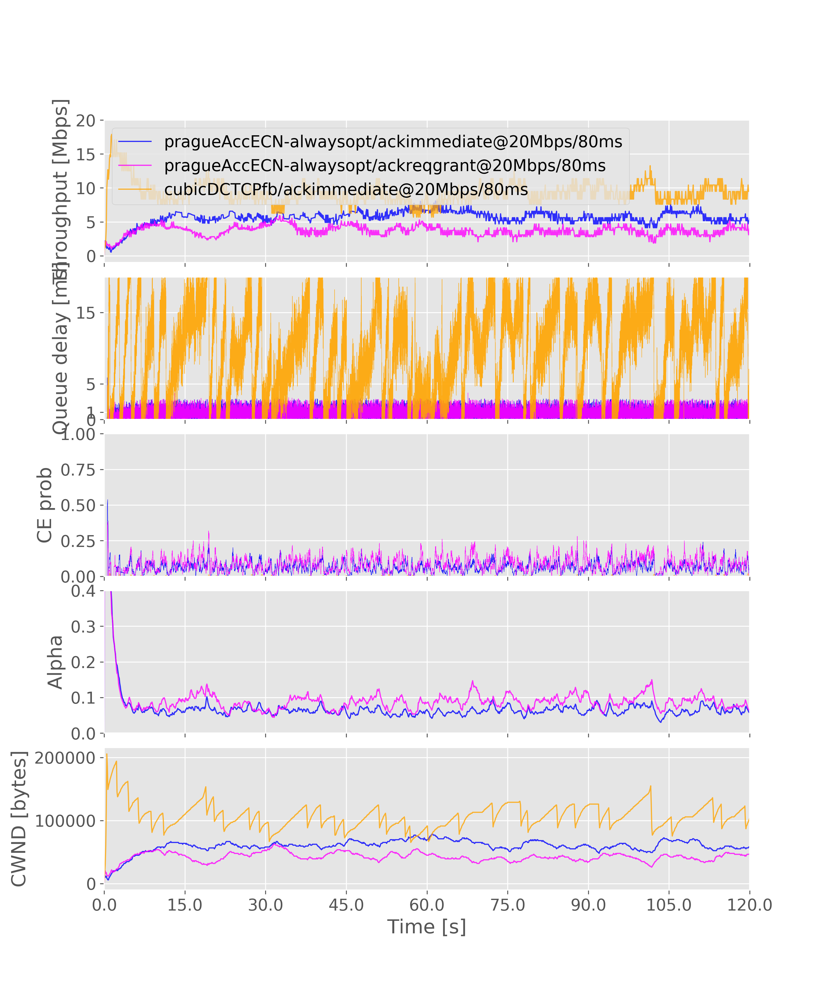

[Go back to index](#description)

# Test-12: PragueAccECN-nooptackimmediate vs ['PragueAccECN-nooptackreqgrant', 'CubicDCTCPfbackimmediate'] at 20Mbit/80ms

RTT: 80ms

BW: 20Mbit

AQM: dualpi2

CCA for flow (1): prague
CCA for flow (2): pragueCCA for flow (3): cubic
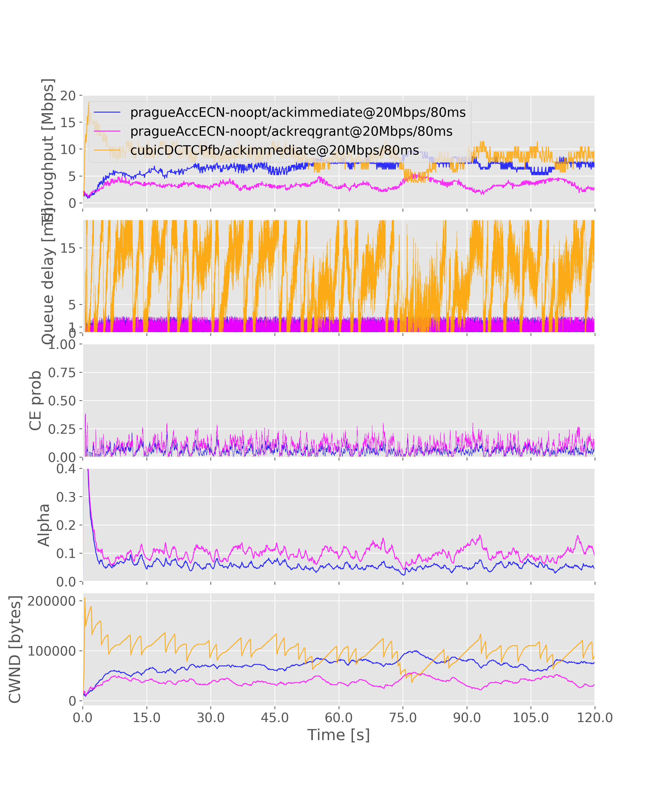

[Go back to index](#description)

# Test-13: PragueDCTCPfbackimmediate vs ['PragueDCTCPfbackreqgrant', 'CubicDCTCPfbackimmediate'] at 100Mbit/20ms

RTT: 20ms

BW: 100Mbit

AQM: dualpi2

CCA for flow (1): prague
CCA for flow (2): pragueCCA for flow (3): cubic
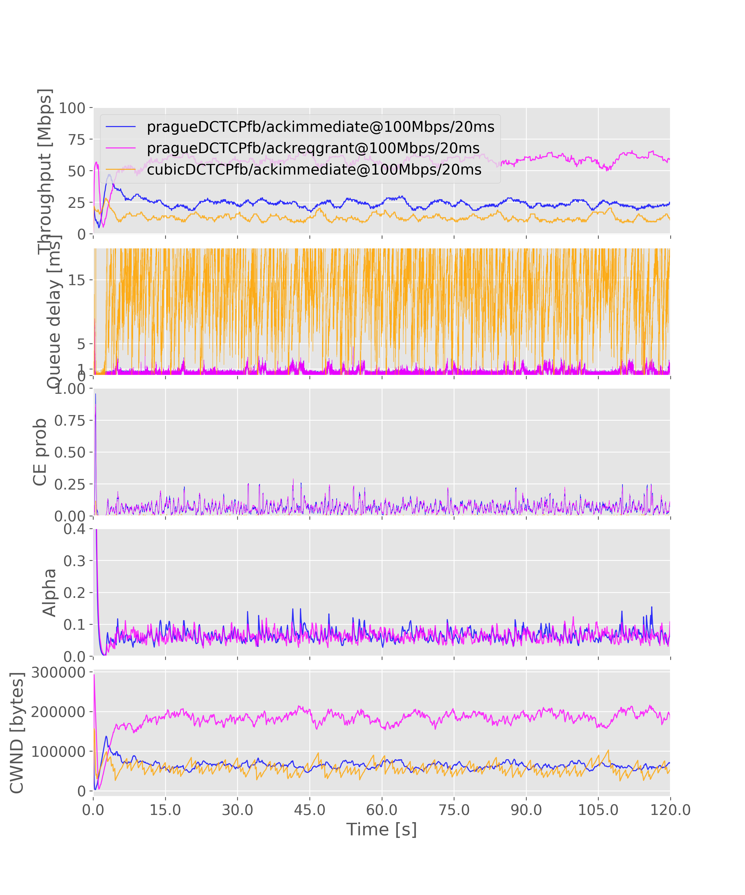

[Go back to index](#description)

# Test-14: PragueAccECN-minoptackimmediate vs ['PragueAccECN-minoptackreqgrant', 'CubicDCTCPfbackimmediate'] at 100Mbit/20ms

RTT: 20ms

BW: 100Mbit

AQM: dualpi2

CCA for flow (1): prague
CCA for flow (2): pragueCCA for flow (3): cubic
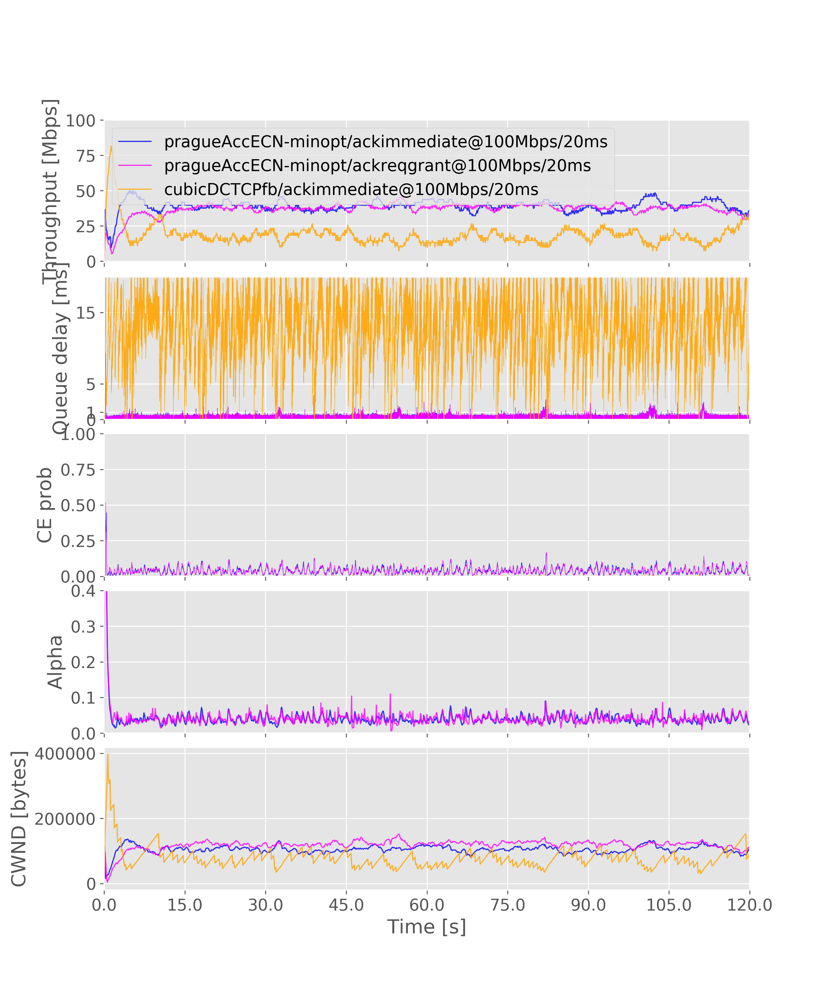

[Go back to index](#description)

# Test-15: PragueAccECN-alwaysoptackimmediate vs ['PragueAccECN-alwaysoptackreqgrant', 'CubicDCTCPfbackimmediate'] at 100Mbit/20ms

RTT: 20ms

BW: 100Mbit

AQM: dualpi2

CCA for flow (1): prague
CCA for flow (2): pragueCCA for flow (3): cubic
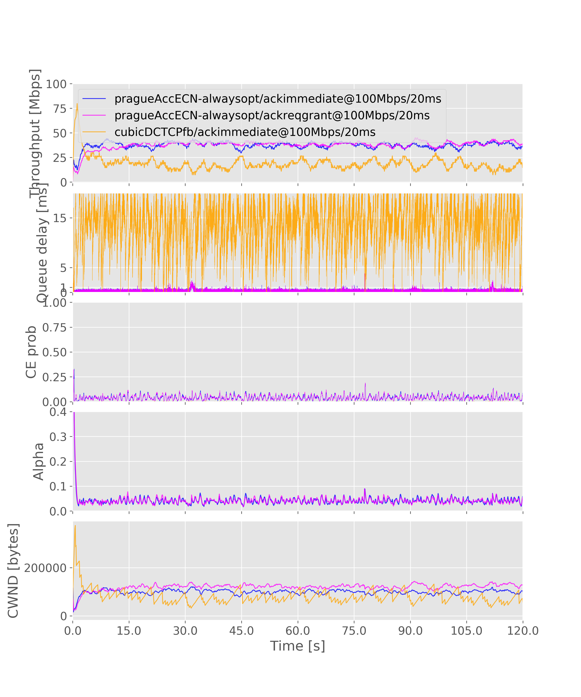

[Go back to index](#description)

# Test-16: PragueAccECN-nooptackimmediate vs ['PragueAccECN-nooptackreqgrant', 'CubicDCTCPfbackimmediate'] at 100Mbit/20ms

RTT: 20ms

BW: 100Mbit

AQM: dualpi2

CCA for flow (1): prague
CCA for flow (2): pragueCCA for flow (3): cubic
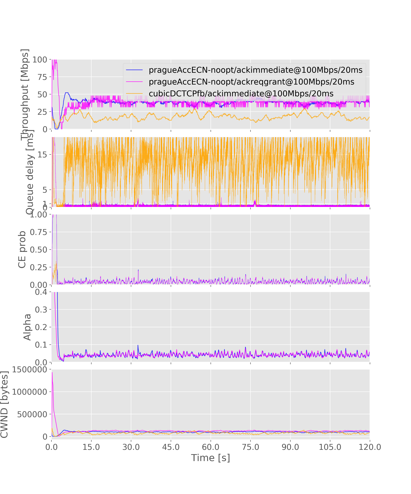

[Go back to index](#description)

# Test-17: PragueDCTCPfbackimmediate vs ['PragueDCTCPfbackreqgrant', 'CubicDCTCPfbackimmediate'] at 100Mbit/40ms

RTT: 40ms

BW: 100Mbit

AQM: dualpi2

CCA for flow (1): prague
CCA for flow (2): pragueCCA for flow (3): cubic
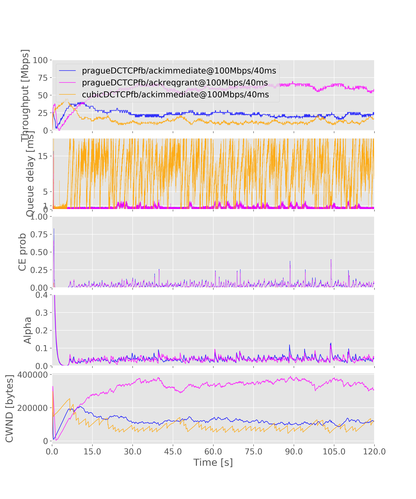

[Go back to index](#description)

# Test-18: PragueAccECN-minoptackimmediate vs ['PragueAccECN-minoptackreqgrant', 'CubicDCTCPfbackimmediate'] at 100Mbit/40ms

RTT: 40ms

BW: 100Mbit

AQM: dualpi2

CCA for flow (1): prague
CCA for flow (2): pragueCCA for flow (3): cubic
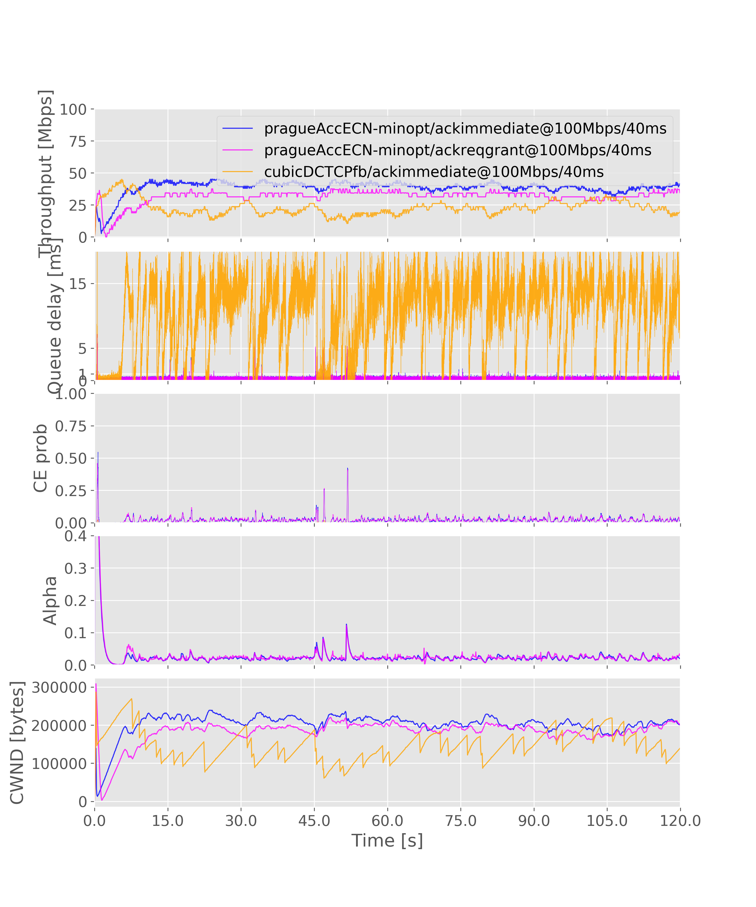

[Go back to index](#description)

# Test-19: PragueAccECN-alwaysoptackimmediate vs ['PragueAccECN-alwaysoptackreqgrant', 'CubicDCTCPfbackimmediate'] at 100Mbit/40ms

RTT: 40ms

BW: 100Mbit

AQM: dualpi2

CCA for flow (1): prague
CCA for flow (2): pragueCCA for flow (3): cubic
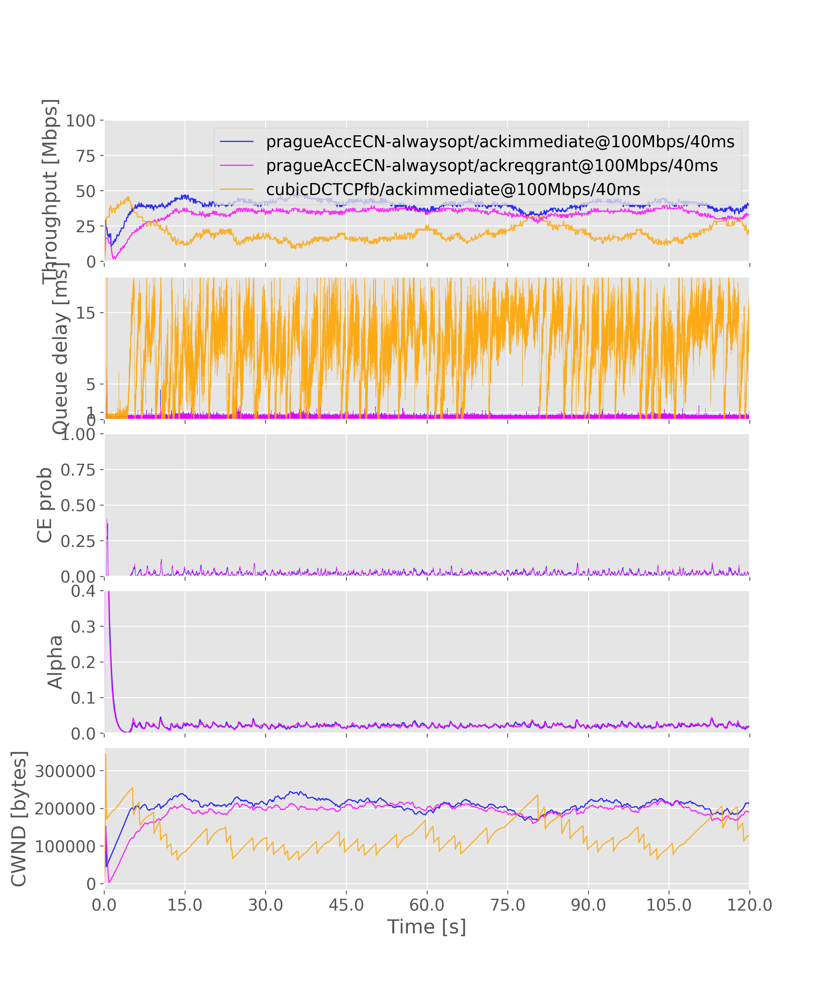

[Go back to index](#description)

# Test-20: PragueAccECN-nooptackimmediate vs ['PragueAccECN-nooptackreqgrant', 'CubicDCTCPfbackimmediate'] at 100Mbit/40ms

RTT: 40ms

BW: 100Mbit

AQM: dualpi2

CCA for flow (1): prague
CCA for flow (2): pragueCCA for flow (3): cubic
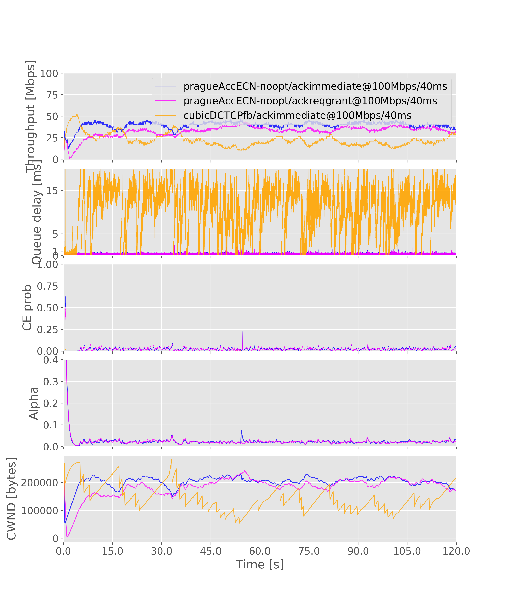

[Go back to index](#description)

# Test-21: PragueDCTCPfbackimmediate vs ['PragueDCTCPfbackreqgrant', 'CubicDCTCPfbackimmediate'] at 100Mbit/80ms

RTT: 80ms

BW: 100Mbit

AQM: dualpi2

CCA for flow (1): prague
CCA for flow (2): pragueCCA for flow (3): cubic
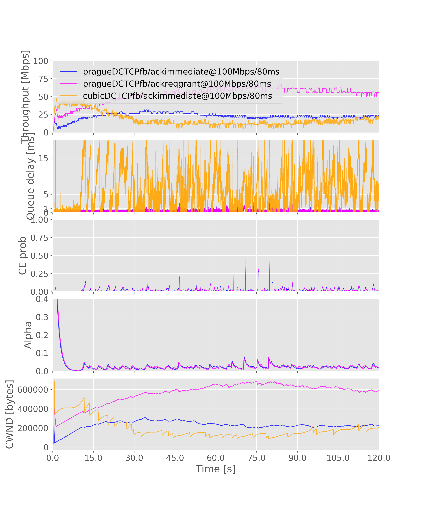

[Go back to index](#description)

# Test-22: PragueAccECN-minoptackimmediate vs ['PragueAccECN-minoptackreqgrant', 'CubicDCTCPfbackimmediate'] at 100Mbit/80ms

RTT: 80ms

BW: 100Mbit

AQM: dualpi2

CCA for flow (1): prague
CCA for flow (2): pragueCCA for flow (3): cubic
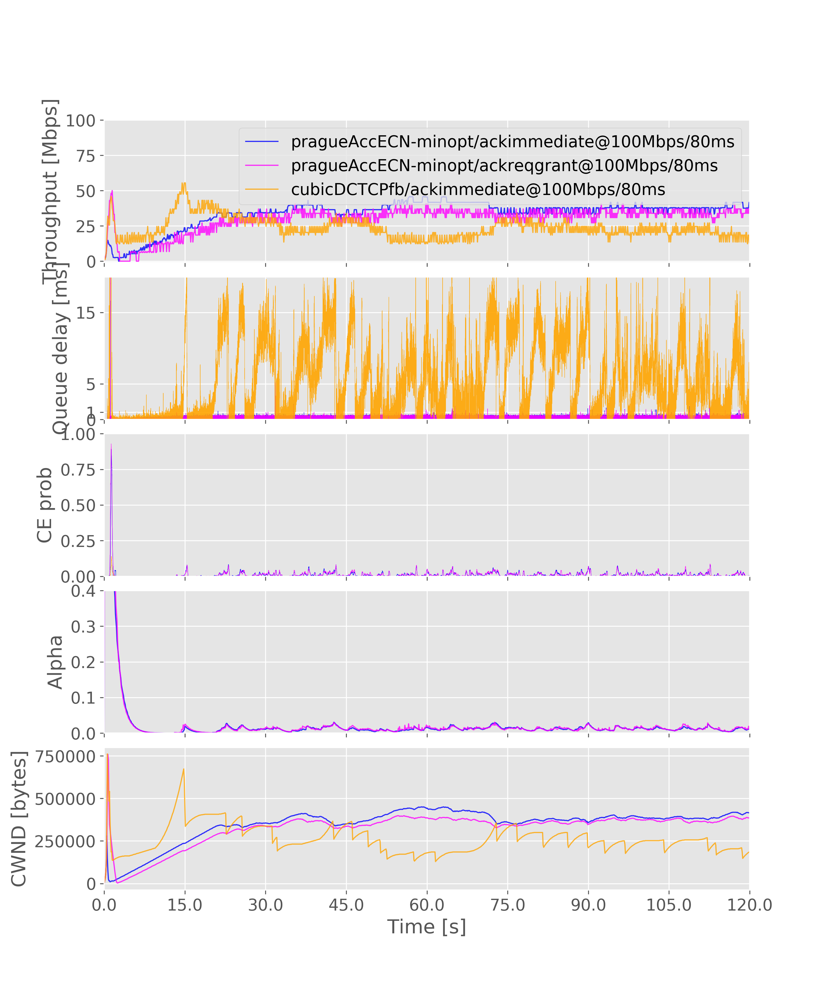

[Go back to index](#description)

# Test-23: PragueAccECN-alwaysoptackimmediate vs ['PragueAccECN-alwaysoptackreqgrant', 'CubicDCTCPfbackimmediate'] at 100Mbit/80ms

RTT: 80ms

BW: 100Mbit

AQM: dualpi2

CCA for flow (1): prague
CCA for flow (2): pragueCCA for flow (3): cubic

[Go back to index](#description)

# Test-24: PragueAccECN-nooptackimmediate vs ['PragueAccECN-nooptackreqgrant', 'CubicDCTCPfbackimmediate'] at 100Mbit/80ms

RTT: 80ms

BW: 100Mbit

AQM: dualpi2

CCA for flow (1): prague
CCA for flow (2): pragueCCA for flow (3): cubic
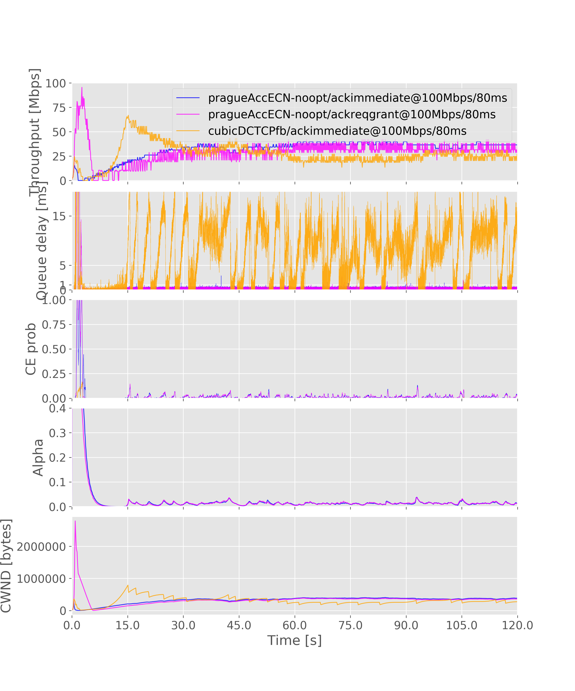

[Go back to index](#description)
